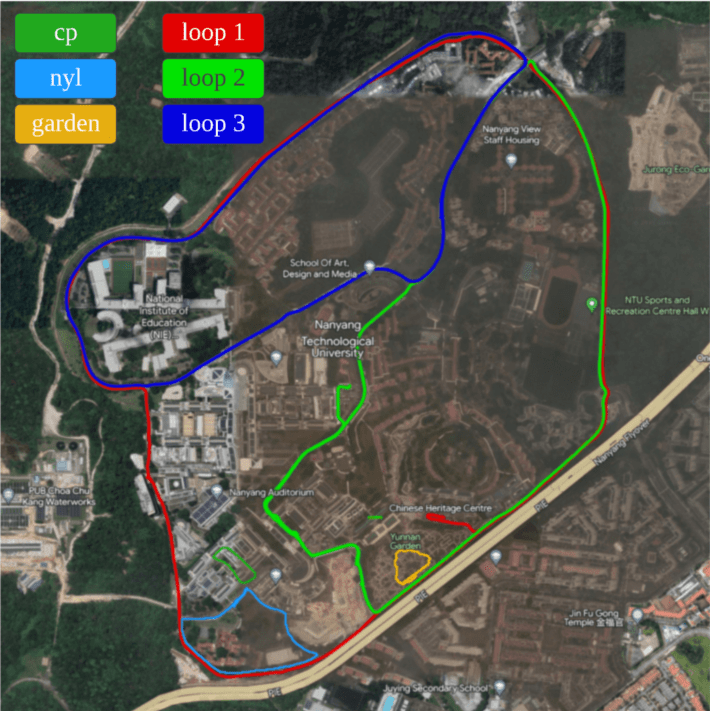
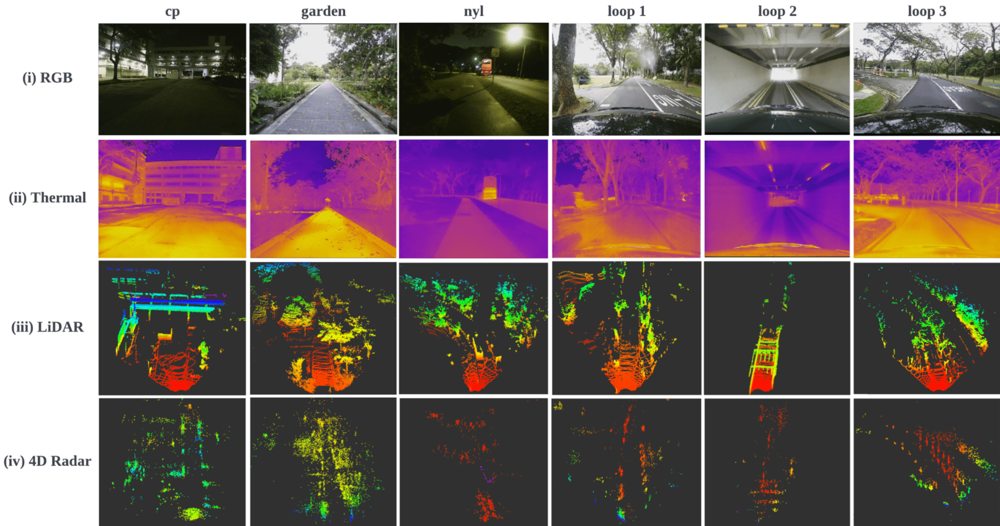
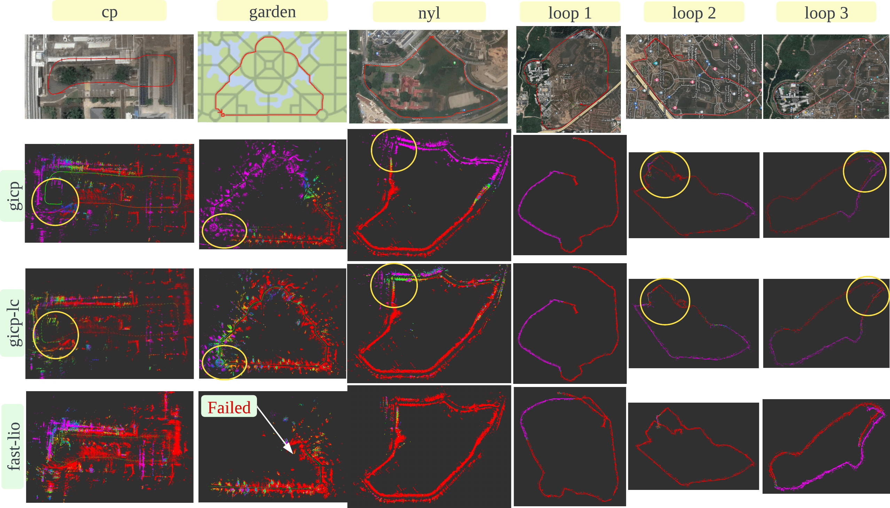

 
# NTU4DRadLM：NTU 4D Radar-centric Multi-Modal Dataset for Localization and Mapping


This repository provides a description and acquisition of NTU4DRadLM. **Note**: The dataset will be available after the paper published.

<div align="center">
<p float="center">

<br />
<b>Example data from our dataset with 4D radar, 3D LiDAR, thermal camera and visual camera. Top: radar (blue) and lidar (red) point cloud. Bottom: projection result from LiDAR onto rgb, LiDAR onto thermal, radar onto rgb, and radar onto thermal. </b>
</p>
</div>


<div align="center">
<p float="center">


<br />
<b>Example data from our dataset with 4D radar, 3D LiDAR, thermal camera and visual camera.</b>
</p>
</div>


## NTU4DRadLM Overview
- [Introduction](#introduction)
<!-- - [Annotation](#annotation) -->
<!-- - [Access_License](#access_license) -->
- [Acknowledgement](#acknowledgement)
<!-- - [Citation](#citation) -->
<br>

## Introduction
NTU4DRadLM is a novel 4D radar dataset specifically proposed for research on **robust SLAM**,  based on 4D radar, thermal camera, and IMU. Totally, the dataset is around **17.6km**, **85mins**, **50GB**. 

<!-- The data will be accessed here. -->

### Motivation 
Simultaneous Localization and Mapping (SLAM) is moving towards a robust perception age. However, LiDAR- and visual- SLAM may easily fail in adverse conditions (rain, snow, smoke and fog, etc.). In comparison, SLAM based on 4D Radar, thermal camera and IMU can work robustly. But only a few literature can be found. A major reason is the lack of related datasets, which seriously hinders the research. Even though
some datasets are proposed based on 4D radar in past four years, they are mainly designed for object detection, rather than SLAM. Furthermore, they normally do not include thermal camera. Therefore, in this paper, NTU4DRadLM is presented to meet this requirement. 

### Characteristics: 

1. It is the only dataset that simultaneously includes all 6 sensors: 4D radar, thermal camera, IMU, 3D LiDAR, visual camera and RTK GPS. 
2. Specifically designed for SLAM tasks, which provides fine-tuned ground truth odometry and intentionally formulated loop closures. 
3. Considered both low-speed robot platform and fast-speed unmanned vehicle platform. 
4. Covered structured, unstructured and semi-structured environments. 
5. Considered both middle- and large- scale outdoor environments, i.e., the 6 trajectories range from 246m to 6.95km. 
6. Comprehensively evaluated three types of SLAM algorithms: 
    - pure 4D radar based 
    - 4D radar + IMU fused
    - 4D radar + thermal camera fused


<div align="center">

<br />
<b>Data acquisition platform.</b>
</div>
<br>

<div align="center">
<p float="center">

<br />
<b>The six trajectories.</b>
</p>
</div>

<div align="center">
<p float="center">

<br />
<b>The data samples.</b>
</p>
</div>

<div align="center">
<p float="center">

<br />
<b>Comparison of three types of radar SLAM on the 6 trajectories.</b>
</p>
</div>

The dataset is organized  as follows.

```
NTU4DRadLM/
├── cp
│   └── cp_YYYY-MM-DD_N.bag (e.g. cp_2022-02-03_0.bag)
│   └── ...
│   └── gt_odom.txt
│   └── gt_odom.bag
├── garden
│   └── ...
├── nyl
│   └── ...
├── loop1
│   └── ...
├── loop2
│   └── ...
├── loop3
│   └── ...
├── calib
│   └── intrinsic_xx.txt
│   └── ...
│   └── extrinsic_xx_to_xx.txt
│   └── ...
└── others
```

<!-- Where, the `ImageSets` folder contains the initial split of the dataset. The `calib` folder contains 
calibration files, each of which has the following contents. The `P2` is the camera
intrinsic parameter matrix. The `Tr_velo_to_cam` is the extrinsic calibration between the 4D radar and the camera in KITTI format. -->

<!-- 
```
P0: 0.000000000000e+00 0.000000000000e+00 0.000000000000e+00 0.000000000000e+00 0.000000000000e+00 0.000000000000e+00 0.000000000000e+00 0.000000000000e+00 0.000000000000e+00 0.000000000000e+00 0.000000000000e+00 0.000000000000e+00
P1: 0.000000000000e+00 0.000000000000e+00 0.000000000000e+00 0.000000000000e+00 0.000000000000e+00 0.000000000000e+00 0.000000000000e+00 0.000000000000e+00 0.000000000000e+00 0.000000000000e+00 0.000000000000e+00 0.000000000000e+00
P2: 1.11042e+03 0.00000000e+00 6.25197e+02 0.00000000e+00 0.00000000e+00 1.11032e+03 4.62072e+02 0.00000000e+00 0.00000000e+00 0.00000000e+00 1.00000000e+00 0.00000000e+00
P3: 0.000000000000e+00 0.000000000000e+00 0.000000000000e+00 0.000000000000e+00 0.000000000000e+00 0.000000000000e+00 0.000000000000e+00 0.000000000000e+00 0.000000000000e+00 0.000000000000e+00 0.000000000000e+00 0.000000000000e+00
R0_rect: 1.000000000000e+00 0.000000000000e+00 0.000000000000e+00 0.000000000000e+00 1.000000000000e+00 0.000000000000e+00 0.000000000000e+00 0.000000000000e+00 1.000000000000e+00
Tr_velo_to_cam: 0.01307991 -0.9998881 -0.00723589 0.00368563 -0.0598935 0.00644008 -0.998184 1.3341627 0.9981189 0.01348954 -0.0598025 2.8750224
``` -->

<!-- The `velodyne` folder contains 4D radar files. The radar point clouds are converted into bin files, each of which contains a Nx8 array. 
```
[X, Y, Z, V_r, Range, Power, Alpha, Beta]
``` -->

<!-- Where N is the number of points and 8 is the feature dimension as follows. Where `V_r` is the relative radial velocity (RRV), `Range` is the detection range to radar center, `Power` is
in dB scale and represents the signal to noise ratio of the detection, `Alpha` and `Beta` are horizontal angle and vertical angle of
the detection, respectively. -->


<!-- 
## Annotation
The `label_2` folder provides the annotation file for each frame. We converted the annotations into KITTI format as follows. There are some differences between TJ4DRadSet and KITTI annotations:
- **Type**: The annotation contains 5 types of objects ('Car', 'Pedestrian', 'Cyclist', 'Truck', 'Other'), which are mapped from the original 7 classes of objects.
- **Truncated**: Integer 0(non-truncated) and 1(truncated), according to whether the object is at the image boundary or not. We did not use it in our study.
- **Occluded**: Integer (0,1,2,3) indicating occlusion state: 0 = fully visible, 1 = small partly occluded, 2 = partly occluded, 3 = largely occluded. We did not use it in our study.
- **Alpha**: Integer 0. Not used, only there to be compatible with KITTI format.
- **Bbox**: Annotation was done in 3D on the LiDAR point cloud. While we provide the 2D bounding boxes in the KITTI formatted labels, these were calculated automatically by projecting the 3D bounding boxes to the camera plane, and assigning a minimum fit rectangle.
```
#Values    Name      Description
----------------------------------------------------------------------------
   1    type         Describes the type of object: 'Car', 'Pedestrian', 'Cyclist', 'Truck', 'Other'.
   1    truncated    Integer 0(non-truncated) and 1(truncated).
   1    occluded     Integer (0,1,2,3) indicating occlusion state:
                     0 = fully visible, 1 = small partly occluded
                     2 = partly occluded, 3 = largely occluded.
   1    alpha        Integer 0. Not used.
   4    bbox         2D bounding box of object in the image (0-based index):
                     contains left, top, right, bottom pixel coordinates. This was automatically calculated from the 3D boxes.
   3    dimensions   3D object dimensions: height, width, length (in meters)
   3    location     3D object location x,y,z in camera coordinates (in meters)
   1    rotation     Rotation ry around Y-axis in camera coordinates [-pi..pi]
```
The tracking annotations are also similar to KITTI format. They are the original annotations of each sequence in the LIDAR coordinate system.
The first column represents the frame number, the second column is the tracking ID, and the third column is the class information. In addition, the annotated classes include the original seven types, which are `Car`, `Pedestrian`, `Cyclist`, `Motorcyclist`, 
`Truck`, `Bus`, `Engineering Vehicles`. An example is as follows.

```
0146 1 Car 0 0 0 457.85464785685105 418.51925272853106 505.77782401266194 455.7979273624884 1.7466730863223 1.8669869318777 4.2109833800027 57.295082952354 5.8145053914078 -2.1813235271045 -0.034961978689325
0146 3 Car 0 0 0 662.7697937503474 413.50692430585116 748.8161098837493 464.9817409351426 1.7053787409195 1.8290438613674 4.5334482016139 40.906472273243 -3.9593908896461 -1.708882967783 0.21957524996303
......
``` -->


<!-- ## Access_License
The dataset is made freely available for non-commercial research purposes only. Eligibility to use the dataset is limited to College/University students. You need to send the specified email address according to the [Non-Disclosure Agreement](https://pan.baidu.com/s/1h3Vbbctxf55PoQi8ZaA5lQ?pwd=tj4d
) (please use Chinese).[Processing time: weekdays after Feb. 7, 2023] -->


## Acknowledgement
<!-- * Annotation was done by [Testin](https://ai.testin.cn/), an AI data services company. -->
* We thank the maintainers of the following repos that enable us to develop our dataset: [HDL_Graph_SLAM](https://github.com/koide3/hdl_graph_slam) by koide3, [4DRadarSLAM](https://github.com/zhuge2333/4DRadarSLAM) by zhuge2333, [Fast-LIO](https://github.com/hku-mars/FAST_LIO) by hku-mars, [rpg_trajectory_evaluation](https://github.com/uzh-rpg/rpg_trajectory_evaluation) by uzh-rpg.
* We referred to [slambook-en](https://github.com/gaoxiang12/slambook-en) and are grateful to Dr. Gao Xiang for his SLAM tutorial.
* We referred to [TJ4DRadSet](https://github.com/TJRadarLab/TJ4DRadSet).
<!-- * We are grateful for the financial support from the . -->


<!-- ## Citation
If you find this work is useful for your research, please consider citing:

```
@INPROCEEDINGS{9922539,  
author={Zheng, Lianqing and Ma, Zhixiong and Zhu, Xichan and Tan, Bin and Li, Sen and Long, Kai and Sun, Weiqi and Chen, Sihan and Zhang, Lu and Wan, Mengyue and Huang, Libo and Bai, Jie},  
booktitle={2022 IEEE 25th International Conference on Intelligent Transportation Systems (ITSC)},   
title={TJ4DRadSet: A 4D Radar Dataset for Autonomous Driving},   
year={2022},  
volume={},  
number={},  
pages={493-498},  
doi={10.1109/ITSC55140.2022.9922539}}
``` -->
