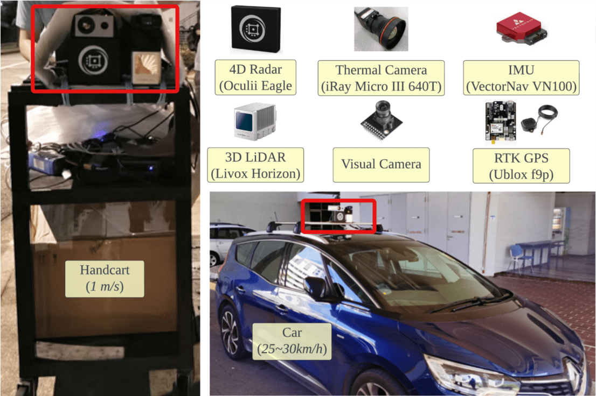

 
# NTU4DRadLM：NTU 4D Radar-centric Multi-Modal Dataset for Localization and Mapping

2023/10/22 update, Download Link: 
[NTU4DRadLM](https://rebrand.ly/ntu4dradlm)

To test the dataset, our 4DRadarSLAM system is open-sourced at: 
[4DRadarSLAM](https://github.com/zhuge2333/4DRadarSLAM)

Paper on arxiv: [Paper](https://arxiv.org/abs/2309.00962) (ITSC 2023 accepted)

This repository provides a description and acquisition of NTU4DRadLM.

<div align="center">
<p float="center">

<br />
<b>Example data from our dataset with 4D radar, 3D LiDAR, thermal camera and visual camera. Top: radar (blue) and lidar (red) point cloud. Bottom: projection result from LiDAR onto rgb, LiDAR onto thermal, radar onto rgb, and radar onto thermal. </b>
</p>
</div>


<div align="center">
<p float="center">


<br />
<b>Example data from our dataset with 4D radar, 3D LiDAR, thermal camera and visual camera.</b>
</p>
</div>


## NTU4DRadLM Overview
- [Introduction](#introduction)
<!-- - [Annotation](#annotation) -->
<!-- - [Access_License](#access_license) -->
- [Acknowledgement](#acknowledgement)
- [Citation](#citation)
<br>

## Introduction
NTU4DRadLM is a novel 4D radar dataset specifically proposed for research on **robust SLAM**,  based on 4D radar, thermal camera, and IMU. Totally, the dataset is around **17.6km**, **85mins**, **50GB**. 


### Motivation 
Simultaneous Localization and Mapping (SLAM) is moving towards a robust perception age. However, LiDAR- and visual- SLAM may easily fail in adverse conditions (rain, snow, smoke and fog, etc.). In comparison, SLAM based on 4D Radar, thermal camera and IMU can work robustly. But only a few literature can be found. A major reason is the lack of related datasets, which seriously hinders the research. Even though
some datasets are proposed based on 4D radar in past four years, they are mainly designed for object detection, rather than SLAM. Furthermore, they normally do not include thermal camera. Therefore, in this paper, NTU4DRadLM is presented to meet this requirement. 

### Characteristics: 

1. It is the only dataset that simultaneously includes all 6 sensors: 4D radar, thermal camera, IMU, 3D LiDAR, visual camera and RTK GPS. 
2. Specifically designed for SLAM tasks, which provides fine-tuned ground truth odometry and intentionally formulated loop closures. 
3. Considered both low-speed robot platform and fast-speed unmanned vehicle platform. 
4. Covered structured, unstructured and semi-structured environments. 
5. Considered both middle- and large- scale outdoor environments, i.e., the 6 trajectories range from 246m to 6.95km. 
6. Comprehensively evaluated three types of SLAM algorithms: 
    - pure 4D radar based 
    - 4D radar + IMU fused
    - 4D radar + thermal camera fused


<div align="center">

<br />
<b>Data acquisition platform.</b>
</div>
<br>

<div align="center">
<p float="center">

<br />
<b>The six trajectories, cp: NTU carpark P (246m), garden: NTU Yunnan Garden (339m), nyl: Nanyang Link (1017m), loop1: big loop of NTU campus boundary (6.95km), loop2: loop of the south half of NTU campus (4.79km), loop3: loop of north half of NTU campus (4.23km).</b>
</p>
</div>

<div align="center">
<p float="center">

<br />
<b>The data samples.</b>
</p>
</div>

<div align="center">
<p float="center">

<br />
<b>Comparison of three types of radar SLAM on the 6 trajectories.</b>
</p>
</div>

The dataset is organized  as follows.

```
NTU4DRadLM/
├── cp
│   └── cp_YYYY-MM-DD_N.bag (e.g. cp_2022-02-03_0.bag)
│   └── ...
│   └── gt_odom.txt
│   └── gt_odom.bag
├── garden
│   └── ...
├── nyl
│   └── ...
├── loop1
│   └── ...
├── loop2
│   └── ...
├── loop3
│   └── ...
├── calib
│   └── intrinsic_xx.txt
│   └── ...
│   └── extrinsic_xx_to_xx.txt
│   └── ...
└── others
```

Information of the rosbags:
| Topic Name |  Message Type | Description |
|:-------:|:----------:|:-------------:|
| /livox/imu | sensor_msgs/Imu | Livox built-in IMU |
| /livox/lidar | livox_ros_driver/CustomMsg | Livox LiDAR point cloud |
| /radar_enhanced_pcl | sensor_msgs/PointCloud | 4D radar enhanced point cloud |
| /radar_pcl | sensor_msgs/PointCloud | 4D radar point cloud |
| /radar_trk | sensor_msgs/PointCloud | 4D radar tracking objects |
| /rgb_cam/image_raw/compressed | sensor_msgs/CompressedImage | RGB image (compressed) |
| /thermal_cam/thermal_image/compressed | sensor_msgs/CompressedImage | Thermal image (compressed) |
| /ublox/fix | sensor_msgs/NavSatFix  | GPS coordinate and covariance |
| /ublox/fix_velocity | geometry_msgs/TwistWithCovarianceStamped | Estimated ego-velocity from GPS |
| /vectornav/imu | sensor_msgs/Imu | VectorNav V100 IMU |

## Acknowledgement
1. 4DRadarSLAM: [4DRadarSLAM](https://github.com/zhuge2333/4DRadarSLAM/) 
2. LiDAR-Visual-Thermal Calibration: [lvt2calib](https://github.com/Clothooo/lvt2calib)
3. LiDAR-Visual-Inertial Odometry for ground truth generation: [R2Live](https://github.com/hku-mars/r2live)
4. RPG trajectory evaluation: [rpg_trajectory_evaluation](https://github.com/uzh-rpg/rpg_trajectory_evaluation)
5. TJ4DRadSet: [TJ4DRadSet](https://github.com/TJRadarLab/TJ4DRadSet)
6. The View of Delft (VoD): [view-of-delft-dataset](https://github.com/tudelft-iv/view-of-delft-dataset)
7. [slambook-en](https://github.com/gaoxiang12/slambook-en) and [Dr. Gao Xiang (高翔)](https://github.com/gaoxiang12). His SLAM tutorial and blogs are the starting point of our SLAM journey

## Citation
If you find this work is useful for your research, please consider citing:

**Dataset**
```
@INPROCEEDINGS{ZhangZhugeLiu2023ITSC,  
author={Jun Zhang∗, Huayang Zhuge∗, Yiyao Liu∗, Guohao Peng, Zhenyu Wu, Haoyuan Zhang, Qiyang Lyu, Heshan Li, Chunyang Zhao, Dogan Kircali, Sanat Mharolkar, Xun Yang, Su Yi, Yuanzhe Wang+ and Danwei Wang},  
booktitle={2023 IEEE 26th International Conference on Intelligent Transportation Systems (ITSC)},   
title={NTU4DRadLM: 4D Radar-centric Multi-Modal Dataset for Localization and Mapping},  
year={2023},  
volume={},  
number={},  
pages={},  
doi={}}
```
**4DRadarSLAM**
```
@INPROCEEDINGS{ZhangZhuge2023ICRA,
  author={Zhang, Jun and Zhuge, Huayang and Wu, Zhenyu and Peng, Guohao and Wen, Mingxing and Liu, Yiyao and Wang, Danwei},
  booktitle={2023 IEEE International Conference on Robotics and Automation (ICRA)}, 
  title={4DRadarSLAM: A 4D Imaging Radar SLAM System for Large-scale Environments based on Pose Graph Optimization}, 
  year={2023},
  volume={},
  number={},
  pages={8333-8340},
  doi={10.1109/ICRA48891.2023.10160670}}
```
**LVT2Calib**
```
@INPROCEEDINGS{ZhangLiu2023IV,
  author={Zhang, Jun and Liu, Yiyao and Wen, Mingxing and Yue, Yufeng and Zhang, Haoyuan and Wang, Danwei},
  booktitle={2023 IEEE Intelligent Vehicles Symposium (IV)}, 
  title={L2V2T2Calib: Automatic and Unified Extrinsic Calibration Toolbox for Different 3D LiDAR, Visual Camera and Thermal Camera}, 
  year={2023},
  volume={},
  number={},
  pages={1-7},
  doi={10.1109/IV55152.2023.10186657}}
```
**3DRadar2ThermalCalib**
```
@INPROCEEDINGS{Zhang2022ITSC,
  author={Zhang, Jun and Zhang, Shini and Peng, Guohao and Zhang, Haoyuan and Wang, Danwei},
  booktitle={2022 IEEE 25th International Conference on Intelligent Transportation Systems (ITSC)}, 
  title={3DRadar2ThermalCalib: Accurate Extrinsic Calibration between a 3D mmWave Radar and a Thermal Camera Using a Spherical-Trihedral}, 
  year={2022},
  volume={},
  number={},
  pages={2744-2749},
  doi={10.1109/ITSC55140.2022.9922522}}
```
